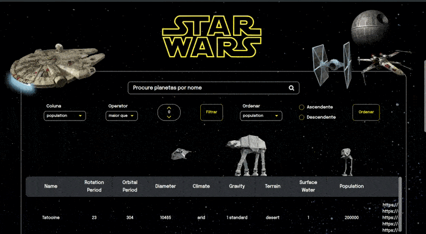

# Projeto StarWars Planets 

Este é um projeto desenvolvido durante o curso de Desenvolvimento Web Full-Stack da Trybe. O objetivo do projeto é criar uma aplicação web que permite ao usuário buscar planetas do universo Star Wars através da API pública disponibilizada pela Lucasfilm Ltd. Foram utilizados filtros em JavaScript para manipular e apresentar os dados dos planetas na aplicação, além dos hooks useState e useEffect do React para gerenciar o estado da aplicação. A Context API do React foi utilizada para permitir o compartilhamento de informações entre componentes da aplicação.

 

 

# Funcionalidades

* Permitir que o usuário pesquise planetas pelo nome;
* Permitir que o usuário pesquise por características numéricas dos planetas;
* Exibir informações sobre o planeta pesquisado, como clima, terreno e número de filmes em que apareceu;
* Exibir uma lista com todos os planetas da API;
* Permitir que o usuário visualize as informações de cada planeta da lista.

# Tecnologias Utilizadas

* React
* JavaScript
* Filtros em JavaScript
* Context API
* Hooks (useState e useEffect) do React
* HTML
* CSS
* RTL
* Jest
* PropTypes

# Requisitos do Projeto

1. Utilizar React e Context API para gerenciar o estado da aplicação;
2. Utilizar a API pública de planetas da Lucasfilm Ltd para obter os dados dos planetas;
3. Exibir uma lista com todos os planetas da API e permitir que o usuário visualize as informações de cada planeta da lista;
4. Permitir que o usuário pesquise planetas pelo nome;
5. Permitir que o usuário pesquise planetas por múltiplos valores numéricos
6. Não permitir pesquisar por filtros numéricos repetidos
7. Exibir um botão que possibilite deletar um filtro de valor numérico ao clicar 
8. Exibir um botão que possibilite  todas filtragens numéricas simultaneamente ao clicar 
9. Permitir que o usuário ordene as colunas de forma ascendente ou descendente
10. Implementar testes utilizando a biblioteca Jest;

# Agradecimentos

Agradecemos à Trybe por nos proporcionar a oportunidade de desenvolver este projeto e aprender novas tecnologias. Também agradecemos à comunidade de desenvolvedores que contribui para o desenvolvimento do React, Redux e outras tecnologias utilizadas neste projeto. E, é claro, agradecemos a George Lucas por criar um universo tão incrível que inspira tantas pessoas até hoje.
